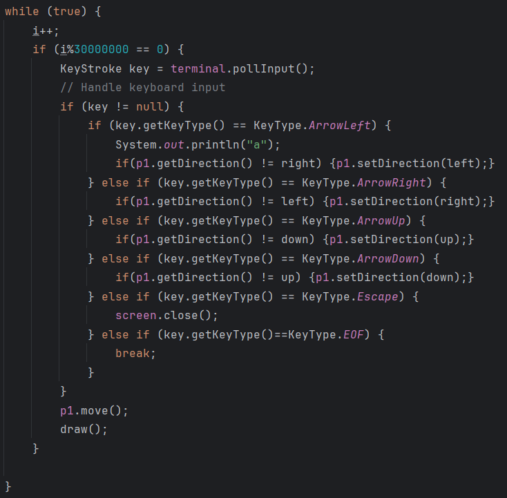
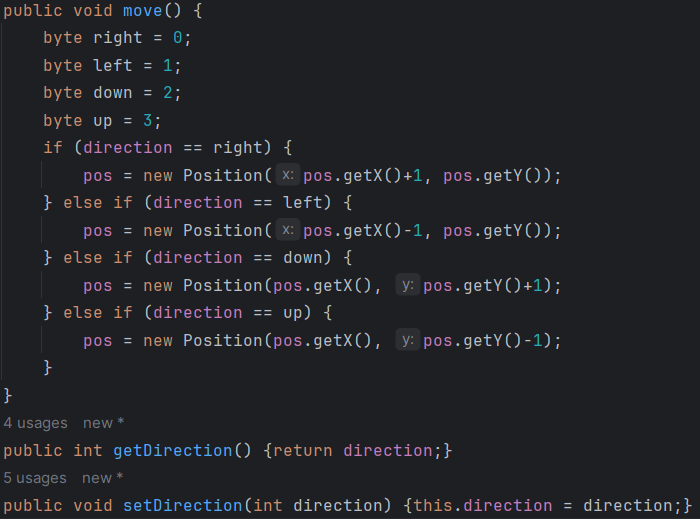

## LDTS_<07><07> - <TRON>

Vamos fazer o trabalho sobre o Tron, um jogo em que dois jogadores controlam uma moto e deixam 1 rastro pela área de jogo. Se alguém tocar no rastro (incluindo o seu), perde.

Projeto desenvolvido por André Moreira Teixeira (up202108882@up.pt), Gonçalo Pinto (up202204943@fe.up.pt), Manuel Mo (up202205000@fe.up.pt) para LDTS 2023/2024.

### IMPLEMENTED FEATURES

- **Screen** - Abrir o terminal onde vai decorrer o jogo.
- **Display** - Dar display ao quadro onde que vai ter as duas motos e os seus rastros e as paredes sempre atualizados.
- **Movimento** - Os dois jogadores vão se mover na direção e sentido da última tecla que pressionaram para se movimentar.
- **Rastro** - As motos vão deixar 1 rastro para trás enquanto se movem.
- **Colisão** - Um jogador que toque em algum dos dois rastros ou na parede vai morrer e assim acabar por perder o jogo.

### PLANNED FEATURES

- **Gigantes** - Monstros que estão no quadro de jogo que vão fazer desaparecer o rastro se houver na posição onde estão ou eliminam os jogadores.
- **Salto** - Um jogador pode saltar evitando assim um rastro à sua frente.
- **Boost** - Um jogador pode andar numa velocidade mais rápida durante um curto período de tempo.

### DESIGN

#### MOVIMENTO

**Problem in Context**

Não conseguimos mover o jogador constantemente sem pressionar nova tecla, isto é, o jogado fica parado até o utilizador clicar numa tecla.

**The Pattern**

Utilizamos o "KeyStroke key = terminal.pollInput();". Graças a esta implementação, a moto do jogador consegue mover-se infinitamente.

**Implementation**

A implementação foi feita na classe *Game*, dentro da função *run*.

Necessitamos também de adicionar algumas funções na classe *Player* para podermos movimentar a moto do jogador.

**Consequences**

O uso desta implementação teve como benefício:

- A constante movimentação da moto do jogador

#### KNOWN CODE SMELLS

> This section should describe 3 to 5 different code smells that you have identified in your current implementation.

### TESTING

- Screenshot of coverage report.
- Link to mutation testing report.

### SELF-EVALUATION

> In this section describe how the work regarding the project was divided between the students. In the event that members of the group do not agree on a work distribution, the group should send an email to the teacher explaining the disagreement.

**Example**:

- John Doe: 40%
- Jane Doe: 60%